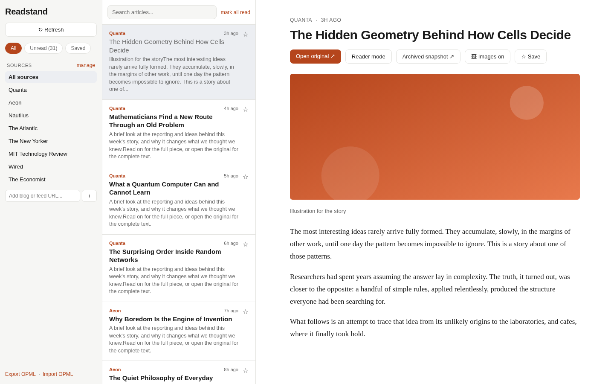
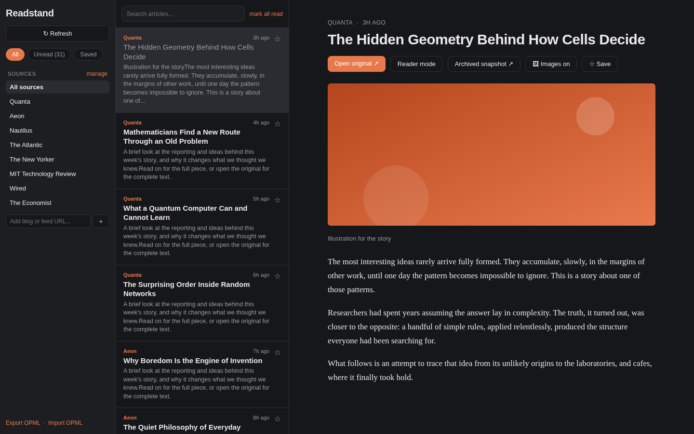

# Readstand

A clean, minimal magazine and blog aggregator packaged as a Chrome extension.
It pulls the RSS/Atom feeds of the publications you follow into one unified,
newest-first reading list. Articles whose feeds carry full text (Quanta, Aeon,
and similar) read inline; paywalled ones show a summary with a one-tap link to
the original.

Built with React + Vite. The same codebase is designed to later wrap into a
Tauri Linux desktop app with minimal changes.

## Screenshots

Light and dark themes (Readstand follows your OS):





## Install

Readstand runs in any Chromium browser (Chrome, Edge, Brave, Vivaldi).

### Option A: from a release (no build tools needed)

1. Download the latest `readstand-<version>.zip` from the
   [Releases page](https://github.com/TitasDas/mag-reader/releases).
2. Unzip it into a folder you intend to keep. Chrome loads the extension from
   that folder, so do not delete it afterwards.
3. Open `chrome://extensions`.
4. Turn on **Developer mode** (top right).
5. Click **Load unpacked** and select the unzipped folder.
6. Click the Readstand icon in the toolbar to open it.

### Option B: build from source

```bash
git clone https://github.com/TitasDas/mag-reader
cd mag-reader
npm install
npm run build     # outputs the extension to dist/
```

Then load the `dist/` folder with **Load unpacked** (steps 3 to 6 above).

Note: extensions load per browser profile, so repeat the load step in each
profile where you want Readstand.

## Features

- Unified timeline across all your feeds, newest first
- Filter by **All / Unread / Saved**, or by individual source
- Full-text reading pane where the feed provides it; link-out where it does not
- **Reader mode** that extracts the readable article from the page's own HTML
  (like Firefox/Safari Reader View)
- **Archived snapshot** to open the article on archive.today in one click
- **Images / Text-only toggle** to read with the publication's pictures, or
  strip them for a distraction-free text view (your choice is remembered)
- **Add any blog by URL**: paste a site or post URL (for example
  `lesswrong.com/about`) and it auto-discovers the RSS/Atom/JSON feed and
  subscribes
- **Auto-refresh**: a background worker checks your feeds every 30 minutes and
  shows a count of new posts as a badge on the toolbar icon
- **Pick the right feed** when a site exposes several (posts, comments, podcast)
- **OPML import / export** to back up your subscriptions or move them between
  readers
- Everything stored locally, no accounts, no server
- Search across titles and previews

## Roadmap

Planned, not yet built:

- **Novelty-based recommendations**: surface articles that are genuinely new or
  different from what you have already read, rather than only the most recent.
- **Automatic feed detection from any link**: find the right feed for any URL
  you paste, even when a page hides or omits its autodiscovery tag.
- **UI/UX improvements**: keyboard navigation, and refinements to the reading
  pane and source management.

## Develop

```bash
npm install
npm run dev      # runs in a normal browser tab (uses localStorage)
```

In dev mode, cross-origin feeds that lack permissive CORS headers may fail to
load. That is expected. Inside the packaged extension they load fine because the
extension is granted host permissions.

## Reading full articles

Feeds that carry full text render completely in the reading pane. For the rest:

- **Reader mode** fetches the article's own public HTML and extracts the body.
  This works when the page ships its text (including many overlay or "soft"
  paywalls that send the article and hide it with CSS). It cannot recover text a
  server never sends, so a hard paywall yields nothing by design.
- **Archived snapshot** opens the page on [archive.today](https://archive.ph), a
  public web-archiving service.
- **Open original** takes you to the publisher, where your own subscription
  applies.

This tool does not bypass DRM and does not fetch content from shadow libraries.

## Adding blogs

Paste any of these into the **Add blog or feed URL** box in the sidebar:

- a site homepage, `lesswrong.com`
- any page on the site, `https://www.lesswrong.com/about`
- the feed itself, `https://www.lesswrong.com/feed.xml`

It checks whether the URL is already a feed, then reads the page's feed
autodiscovery tags, then probes common feed paths (`/feed`, `/rss.xml`,
`/index.xml`, and similar). RSS, Atom, and JSON Feed are all supported. If a
site offers more than one feed (for example posts vs comments), you pick which
to subscribe to. Once subscribed, new posts are pulled in automatically on
refresh.

## Backup and migration (OPML)

Use **Export OPML** / **Import OPML** at the bottom of the sidebar to save your
subscription list or bring one over from another reader. OPML is the standard
format every feed reader understands.

## Calibre (companion workflow)

[Calibre](https://calibre-ebook.com) can download many periodicals on a schedule
via its built-in recipes (**Fetch news**), delivering a clean EPUB/PDF to your
reader or e-ink device. Recipes for paywalled titles use **your own subscription
credentials**, which you enter in Calibre. A Chrome extension cannot drive
Calibre directly, so run it alongside Readstand when you want an offline,
packaged issue.

## Default feeds

Quanta, Aeon, Nautilus, The Atlantic, The New Yorker, MIT Technology Review,
Wired, The Economist. Edit `src/feeds.js` or add and remove feeds in the app.
