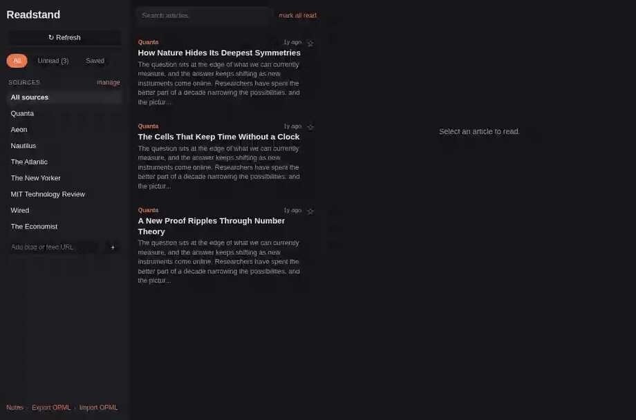
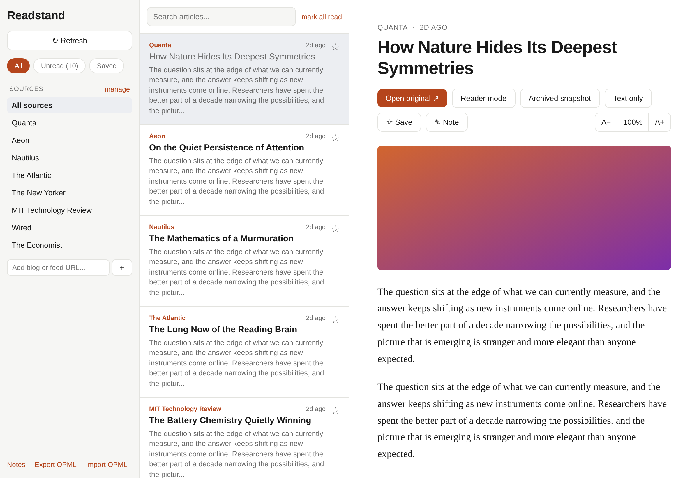
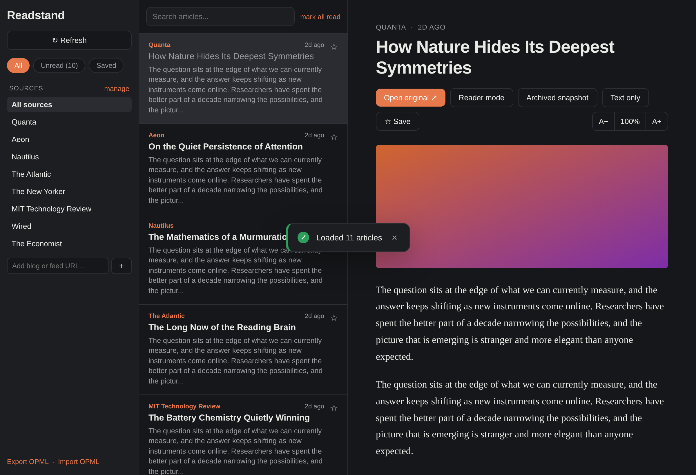
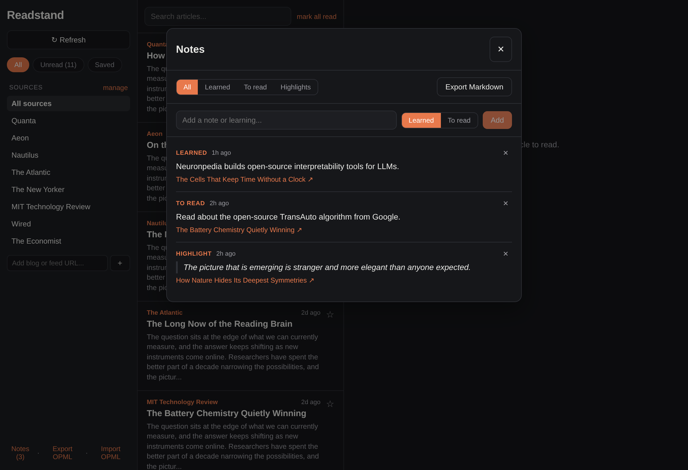
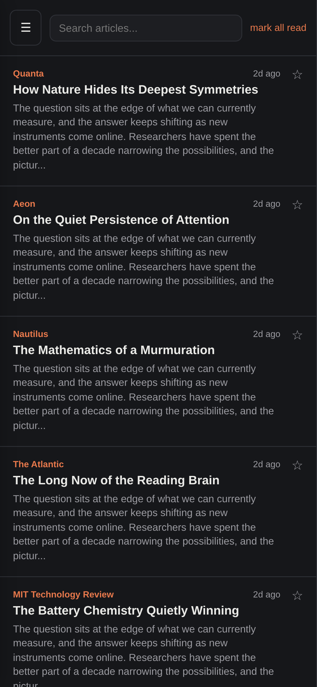
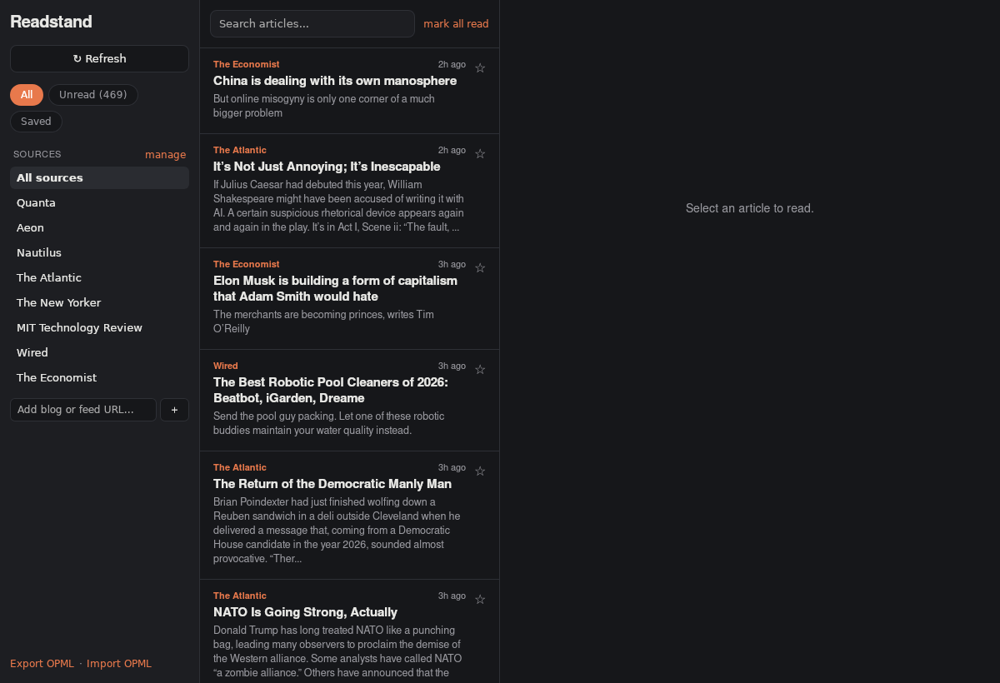

# Readstand

**Your magazines and blogs, in one calm place. No feed algorithm. No noise. Just the reading you chose.**

Readstand pulls the RSS and Atom feeds of the publications you actually care about into a single, fast, distraction-free reader. It runs as a Chrome extension, an installable web app for your phone, and a native Linux desktop app, all from the same code. Everything is stored locally. No account, no tracking, no one deciding what you see.



*Read, highlight a line, jot what you learned, export to Markdown. That is the whole loop.*





---

## Why bother reading on purpose?

Most of what you read now is chosen by a recommendation engine optimized to keep you scrolling. Readstand flips that: you pick the sources, you get everything they publish, in order, and then you close the tab. That small shift, from feed to reading list, is worth more than it sounds.

The research on long-form reading is genuinely encouraging:

- **It rewires your brain, measurably.** Neuroscientists at Emory University scanned readers every day while they worked through a novel. Reading produced real, lasting increases in brain connectivity, including in regions tied to language and to physical sensation, and the effect persisted for days after each session ([Emory / Brain Connectivity, 2013](https://pmc.ncbi.nlm.nih.gov/articles/PMC3868356/)).
- **Readers live longer.** A Yale study followed 3,635 people for 12 years. Those who read books for about half an hour a day outlived non-readers by nearly two years, even after adjusting for education, wealth, and health. The effect was strongest for deep, book-length reading ([Yale / Social Science & Medicine, 2016](https://pubmed.ncbi.nlm.nih.gov/27471129/)).
- **Attention is a muscle.** In *Reader, Come Home*, cognitive scientist Maryanne Wolf argues that deep reading, the slow immersive kind, builds the very focus that endless scrolling erodes. Readstand is built for that mode: one article, full width, nothing blinking at you.

These are associations from real studies, not medical promises. But the direction is clear, and it points at the same thing: reading things you chose, slowly, is good for the machine between your ears.

Readstand adds one more idea on top: **reading is where your next idea comes from.** So it also helps you catch and keep those sparks (see Notes, below).

---

## What you get

### One unified, newest-first feed
Every source you follow, merged into a single timeline. Filter by **All / Unread / Saved**, jump to any one publication, or search across everything. Full text renders inline where the feed provides it; where it does not, one tap opens the original.

### A real reading experience
- **Reader mode** extracts the clean article from the page, like Safari or Firefox Reader View, images and all.
- **Archived snapshot** opens the article through archive.today (with mirror fallback), which is also how you slip past a soft paywall.
- **Text-only toggle** strips images for pure focus, and **A- / A+ zoom** sets your comfortable reading size. Both are remembered.
- In-article links open inside the reader, with a Back trail, so you can follow a thread without losing your place.

### Continue reading
Readstand quietly tracks how far you got in each article. Come back tomorrow and the ones you started but did not finish are waiting in a **Continue reading** list in the sidebar, each with a progress bar. Click one and it drops you exactly where you stopped.

### Notes and highlights, exportable
Select any sentence to save it as a highlight. Jot a quick **Learned** or **To read** note without leaving the article. Everything lands in a Notes panel you can filter, and one click exports the lot to a **Markdown file**, ready for Obsidian or any notes app. Never lose a learning to tomorrow-morning-you again.



### Add anything, even sites that hide their feed
Paste a blog homepage, a specific post, or a raw feed URL. Readstand auto-discovers the feed. For big publishers whose article pages hide their feed on another host, it knows the pattern and subscribes you to the right section. If there is genuinely no feed, it will still let you read that one article, and offer to report the miss.

Publishers it recognizes out of the box:

| Publisher | What Readstand finds |
|---|---|
| New York Times | section feeds on `rss.nytimes.com`, derived from the article |
| The Guardian | the matching `/<section>/rss` |
| Washington Post | the homepage feed |
| BBC | the news RSS feed |
| The Verge | the site feed |
| Financial Times | the section feed plus the home feed |
| Wall Street Journal | the matching section feed on `feeds.a.dj.com` |
| The Economist | the matching `/<section>/rss.xml` |
| Bloomberg | the section news feed |
| Ars Technica | the main feed |
| Medium | the publication or author feed |

Everything else falls back to standard feed autodiscovery. Miss something? One tap on **Report missing feed** opens a prefilled issue so a pattern can be added.

### Built for the couch, the commute, and the desk
Fully responsive. On a phone it becomes a single-pane, tap-to-read experience with a slide-in sources drawer. Install it to your home screen and it runs full screen, offline-capable.



### Yours, and private
No accounts. No servers. No analytics. Your feeds, your read history, your notes, all live in local storage on your own device. Back them up any time with OPML export.

---

## Get it running

Readstand runs three ways from one codebase. Pick whichever fits.

### Chrome extension (fastest)
```bash
git clone https://github.com/TitasDas/mag-reader
cd mag-reader
npm install
npm run build
```
Then open `chrome://extensions`, turn on **Developer mode**, click **Load unpacked**, and select the `dist/` folder. Click the Readstand icon to open it.

### Linux desktop app (native)
A real desktop window via [Tauri](https://tauri.app). On the desktop it fetches feeds natively, so it needs no proxy and hits no CORS wall.

```bash
# one-time prerequisites
curl --proto '=https' --tlsv1.2 -sSf https://sh.rustup.rs | sh -s -- -y
sudo apt update && sudo apt install -y libwebkit2gtk-4.1-dev build-essential curl wget file \
  libxdo-dev libssl-dev libayatana-appindicator3-dev librsvg2-dev   # Debian / Ubuntu / Mint

. "$HOME/.cargo/env"
npm install
npm run tauri:build   # builds a .deb and an AppImage in src-tauri/target/release/bundle/
```



### On your phone (installable web app)
A Chrome extension cannot install on a phone, so Readstand also builds as a PWA. Because a web page (unlike the extension) cannot read cross-origin feeds, deploy the tiny CORS proxy in [`proxy/worker.js`](proxy/worker.js), then:
```bash
VITE_FEED_PROXY="https://your-proxy.workers.dev/?url=" npm run build
# host dist/ over HTTPS anywhere, open it on your phone, and Add to Home Screen
```

---

## Why it exists

A good magazine is an idea reactor: reading Gizmodo as a kid is what got me tinkering with gadgets (including, once, a robot that chops vegetables). Years later I could never quite explain to a CEO why reading a book in the middle of building trading algorithms was not a waste of work time; it was where half the good ideas came from. But today's reading fights that, with algorithmic feeds, ads, flashy whatnots, half-read tabs, and good ideas you forget by morning. Readstand is the tool I wanted: a quiet, ad-free place with no algorithm and nothing blinking at you, to read on purpose and catch the sparks before they fade.

Built by Titas Das. [GitHub](https://github.com/TitasDas) and [LinkedIn](https://www.linkedin.com/in/titas-das/).

---

## Notes for the curious

- **Default sources** to get you started: Quanta, Aeon, Nautilus, The Atlantic, The New Yorker, MIT Technology Review, Wired, The Economist. Add or remove any of them in the app.
- **Paywalls** stand. Readstand does not crack DRM or pull from shadow libraries. For paywalled pieces it gives you the headline and a link, plus the archived-snapshot option, which uses your own right to read.
- **Missing a publisher?** If a site has no discoverable feed, use **Report missing feed** in the app to open a prefilled issue, and a pattern can be added.
- **Develop / test:** `npm run dev` for a live server, `npm run test:e2e` for the headless end-to-end suite, `npm run icons` and `npm run shots` to regenerate the icon set and screenshots.

Happy reading.
